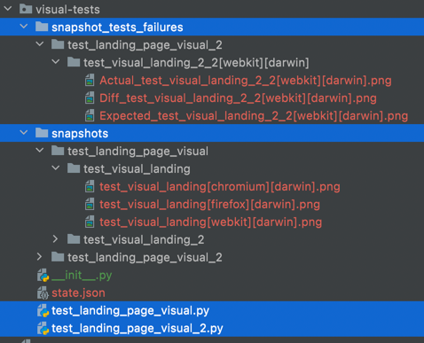

# Pytest Plugin for Visual Testing with Playwright

Based on [pixelmatch-py](https://github.com/whtsky/pixelmatch-py) image comparison library.

Expands `assert_snapshot` fixture from [pytest-playwright-snapshot](https://github.com/kumaraditya303/pytest-playwright-snapshot) library 

## Main Features:
- snapshots creation on the first run
- visual review of mismatches
- failing on `--update-snapshots` to make users manually review images
- snapshot name is optional, `test_name[browser][os].png` is auto-generated by default
- updated folder structure: `snapshots/file_name/test_name/test_name[browser][os].png`

## Installation

```bash
$ pip install pytest-playwright-visual
```

## Usage

This plugin provides a `assert_snapshot` fixture which is used to create snapshots and compare it.

Example:

```python
def test_myapp(page, assert_snapshot):
    page.goto("https://example.com")
    assert_snapshot(page.screenshot())
```
Then, run pytest:
```bash
$ pytest
```
The first time you run pytest, snapshots will be created, and you will get the error:

```console
Failed: --> New snapshot(s) created. Please review images
```

The next run, the snapshots comparison will take place. 

To update snapshots, run:

```bash
$ pytest --update-snapshots
```

After updating, tests will fail and you will need to review images.

In case of a mismatch, `snapshot_tests_failures` folder will be created with `Actual_..`, `Expected_..` and `Diff_..` images generated.

## Folder Structure Example



## API
**assert_snapshot(page.screenshot(), threshold: float = 0.1, name='test_name[browser][os].png', fail_fast=False)**
- `threshold` - sets the threshold for the comparison of the screenshots:`0` to `1`. Default is `0.1`
- `name` - `.png` extensions only. Default is `test_name[browser][os].png` (recommended)
- `fail_fast` - If `True`, will fail after first different pixel. `False` by default
## License

Apache 2.0 LICENSE
